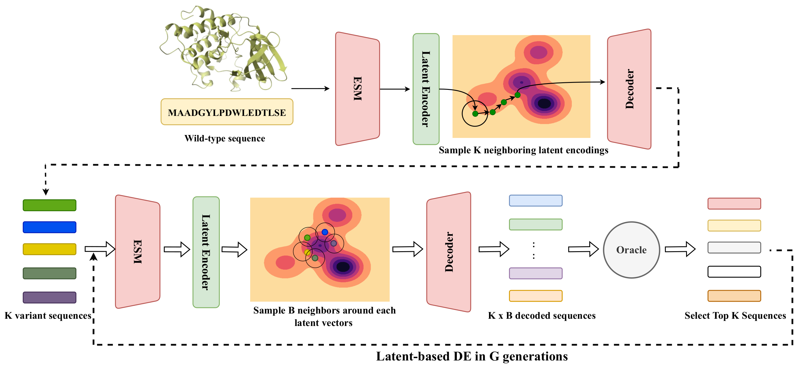

<div align="center">

# LatentDE: Latent-based Directed Evolution for Protein Sequence Design
</div>



## Publication

LatentDE: Latent-based Directed Evolution for Protein Sequence Design, Machine Learning: Science and Technology, DOI 10.1088/2632-2153/adc2e2

https://iopscience.iop.org/article/10.1088/2632-2153/adc2e2

```bibtex
@article{Tran_2025,
doi = {10.1088/2632-2153/adc2e2},
url = {https://dx.doi.org/10.1088/2632-2153/adc2e2},
year = {2025},
month = {mar},
publisher = {IOP Publishing},
volume = {6},
number = {1},
pages = {015070},
author = {Tran, Thanh V T and Khang Ngo, Nhat and Thanh Duy Nguyen, Viet and Hy, Truong-Son},
title = {LatentDE: latent-based directed evolution for protein sequence design},
journal = {Machine Learning: Science and Technology},
abstract = {Directed evolution (DE) has been the most effective method for protein engineering that optimizes biological functionalities through a resource-intensive process of screening or selecting among a vast range of mutations. To mitigate this extensive procedure, recent advancements in machine learning-guided methodologies center around the establishment of a surrogate sequence-function model. In this paper, we propose latent-based DE (LDE), an evolutionary algorithm designed to prioritize the exploration of high-fitness mutants in the latent space. At its core, LDE is a regularized variational autoencoder (VAE), harnessing the capabilities of the state-of-the-art protein language model, ESM-2, to construct a meaningful latent space of sequences. From this encoded representation, we present a novel approach for efficient traversal on the fitness landscape, employing a combination of gradient-based methods and DE. Experimental evaluations conducted on eight protein sequence design tasks demonstrate the superior performance of our proposed LDE over previous baseline algorithms. Our implementation is publicly available at https://github.com/HySonLab/LatentDE.}
}
```

## Workshops

NeurIPS 2024:
* AI for Accelerated Materials Design: https://openreview.net/pdf?id=4YkbQGVWGF
* Workshop on AI for New Drug Modalities: https://openreview.net/pdf?id=8AmP6pQwyP
* Machine Learning for Structural Biology Workshop: https://www.mlsb.io/papers_2024/LatentDE:_Latent-based_Directed_Evolution_accelerated_by_Gradient_Ascent_for_Protein_Sequence_Design.pdf

## Preprint

Latent-based Directed Evolution accelerated by Gradient Ascent for Protein Sequence Design

https://www.biorxiv.org/content/10.1101/2024.04.13.589381v1

```bibtex
@article {Ngo2024.04.13.589381,
	author = {Nhat Khang Ngo and Thanh V. T. Tran and Viet Thanh Duy Nguyen and Truong Son Hy},
	title = {Latent-based Directed Evolution accelerated by Gradient Ascent for Protein Sequence Design},
	elocation-id = {2024.04.13.589381},
	year = {2024},
	doi = {10.1101/2024.04.13.589381},
	publisher = {Cold Spring Harbor Laboratory},
	abstract = {Directed evolution has been the most effective method for protein engineering that optimizes biological functionalities through a resource-intensive process of screening or selecting among a vast range of mutations. To mitigate this extensive procedure, recent advancements in machine learning-guided methodologies center around the establishment of a surrogate sequence-function model. In this paper, we propose Latent-based Directed Evolution (LDE), an evolutionary algorithm designed to prioritize the exploration of high-fitness mutants in the latent space. At its core, LDE is a regularized variational autoencoder (VAE), harnessing the capabilities of the state-of-the-art Protein Language Model (pLM), ESM-2, to construct a meaningful latent space of sequences. From this encoded representation, we present a novel approach for efficient traversal on the fitness landscape, employing a combination of gradient-based methods and directed evolution. Experimental evaluations conducted on eight protein sequence design tasks demonstrate the superior performance of our proposed LDE over previous baseline algorithms. Our implementation is publicly available at https://github.com/HySonLab/LatentDECompeting Interest StatementThe authors have declared no competing interest.},
	URL = {https://www.biorxiv.org/content/early/2024/04/16/2024.04.13.589381},
	eprint = {https://www.biorxiv.org/content/early/2024/04/16/2024.04.13.589381.full.pdf},
	journal = {bioRxiv}
}
```

## Table of Contents:

- [Introduction](#introduction)
- [Structure Description](#structure-description)
- [Installation](#installation)
- [Usage](#usage)
    - [Training](#training)
    - [Inference](#inference)

## Introduction
This is the official implementation of the paper Latent-based Directed Evolution accelerated by Gradient Ascent for Protein Sequence Design.

## Structure description

Our repository is structured as follows:
```shell
.
├── active_optimize.sh          # inference + active learning
├── environment.yml
├── exps                        # experiments results
├── optimize.sh                 # inference
├── preprocessed_data
├── README.md
├── scripts                     # main executable scripts
├── src
│   ├── common                  # common utilities
│   ├── dataio                  # dataloader
│   └── models
├── train.sh                    # training script
└── visualize_latent.sh         # visualize trained latent
```

## Installation

You should have Python 3.10 or higher. I highly recommend creating a virtual environment like conda. If so, run the below commands to install:

```shell
conda env create -f environment.yml
```

Download the oracle landscape models by the following commands (using script provided [here](https://github.com/HeliXonProtein/proximal-exploration)):
```shell
cd scripts
bash download_landscape.sh
```

## Usage

### Training

To train VAE model for each benchmark dataset, go to the root directory and execute the `train.sh` file. Take `avGFP` as the example, run the following command:

```shell
bash train.sh ./scripts/configs/rnn_template.py 0 template avGFP 20 256
```

Checkpoints will be saved in `exps/ckpts/` folder. Details of passed arguments can be found [here](./scripts/train_vae.py)

### Inference

To perform optimization, go to the root directory and execute the `optimize.sh` file. Take `avGFP` as the example, run the following command:

```shell
bash optimize.sh avGFP 0 template <model_ckpt_path> <oracle_ckpt_path> 1 rnn
```

Similar to perform active learning alongside with optimization, you can see details of passed argumetns in [`active_optmize.sh`](./active_optimize.sh) file.

Results will be saved in `exps/results_no_active` and `exps/results` folders.

To average results of 5 seeds, check [`calculate.py`](./scripts/calculate.py).
